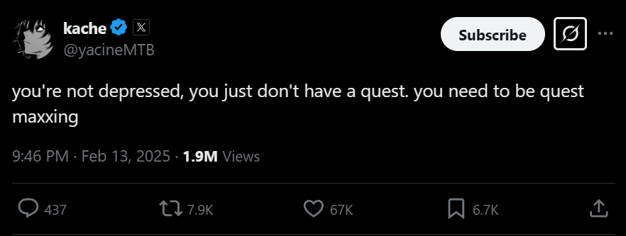

I think about this a lot.

A lot of people get lost after university, since they do not know what to do. 
They are trained to do whatever teacher/mentor/whatever person tells them to do or gives assignment to do. 

These people lack exploration abilities or just not passionate about what they do. 
They need some quest, not from someone or some course on the internet, but from their hearts. 
People need to think about their desires in life and use them to do things.

My problem is similar to this, but I tend to ignore doing things because I see anything tech related trivial. 
Meaning that I do not want to do certain things just because I make way too many assumptions about the topic. 
It results in a really good plan to do things, but it is terrible for exploration. 
I know what I will face next (I just assume too much).

This makes me look like a smart person (at least skilled person), but deep down I am a typical "проебан". (translation: person who fucks up thing(mainly own life choices))

Solution is pretty simple — just do things. 
Never though that seemingly stupid tweet from Sam Altman from several months ago will be so much relatable. 
Indeed, you can just do things.

This does not only apply to me. 
Anybody can do anything. 
It just takes some amount of  self-reflection about career/hobby goals. 
You want to make a game on web browser? Go for it. 
You want to set up a movie server on your old PC. Go for it. 
You want to develop some tooling so your fellow colleagues can have better developer experience. Go for it. 
If you think that you cannot do anything or have no project to do — you are wrong. 
Just explore the internet, see what other people like to do. 
Main goal is to get any results from your work. 
You will be surprised how positively it affects you. 
Getting that dopamine dose from successfully fixing a bug or making feature to work feel really good. 

This is thoughts of 21 years old me.
So, do not take anything here seriously.
Probably will revisit this several years later to make an update.
