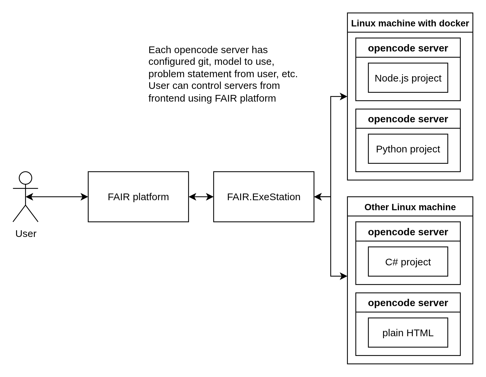

The landscape of software development is shifting. For decades, we've been tethered to our local machines—configuring environments, managing dependencies, and wrestling with the infamous ["works on my machine" problem](https://coder.com/blog/it-works-on-my-machine-explained). But something interesting is happening: development is moving to the cloud, and AI agents are about to make this transition not just viable, but necessary.

## The Cloud Development Paradox

Dev containers have been "trying to be a thing" for years now. Tools like [VS Code Dev Containers](https://code.visualstudio.com/docs/devcontainers/containers) and [GitHub Codespaces](https://github.com/features/codespaces) promised us reproducible, cloud-based development environments. Yet, adoption remained lukewarm. Why? Because the value proposition wasn't compelling enough for most developers to abandon their carefully crafted local setups.

But here's where it gets interesting: the emergence of AI coding assistants like [Claude Code](https://www.claude.com/product/claude-code), [OpenCode](https://opencode.ai/), [OpenAI's Codex CLI](https://developers.openai.com/codex/cli/), and [Gemini CLI](https://geminicli.com/) is changing the equation. These tools aren't just autocomplete on steroids—they're autonomous agents capable of executing complex development tasks. And autonomous agents need a safe, isolated place to run.

Suddenly, dev containers aren't just nice-to-have. They're essential infrastructure.

## The Vision: Asynchronous Software Development

Imagine delegating a feature implementation to an AI agent the same way you'd assign a task to a junior developer. You define the problem, provide context, and let the agent handle the research, coding, testing, and even initial deployment—all while you sleep or focus on higher-level architecture.

This isn't science fiction. The technology exists today. The question is: how do we build a platform that makes this workflow practical?

Here's my vision: a development platform where humans define problems and AI agents solve them asynchronously. Developers and "vibe-coders" alike can work on multiple problems simultaneously, with agents iterating through solutions much faster than any human could. The human stays in the loop only when needed—for approvals, architectural decisions, or when the agent hits a wall.

The limitation? Code becomes non-deterministic. When code is generated from natural language prompts, the LLM makes assumptions based on context—or lack thereof. This is both a feature and a bug.

## The Reality Check: My Journey

I've spent considerable time with commercial solutions like [Cursor Agent](https://cursor.com/docs/background-agent) and [GitHub Copilot's background agent](https://docs.github.com/en/copilot/concepts/agents/coding-agent/about-coding-agent). They work, and they work well. But they have two critical limitations for my use case:
1. They're not self-hostable
2. They offer minimal programmatic control via API

These constraints pushed me to explore building my own solution.

### Attempt 1: [Coder.com](https://coder.com/)

I started with self-hosted [Coder.com](https://coder.com/). On paper, it seemed perfect—managed dev containers with task automation features. In practice? The [Tasks](https://coder.com/docs/ai-coder/tasks) feature is still in development and incomplete. I tried running [Codex CLI](https://developers.openai.com/codex/cli/) in the environment, but it didn't work reliably.

However, [Claude Code](https://www.claude.com/product/claude-code) showed real promise. It executed terminal commands autonomously and behaved like a proper agent. Unfortunately, integrating it with our existing AI platform proved more difficult than anticipated. I needed something more flexible.

### Attempt 2: The Docker Route

This is where things got interesting. I already maintain FAIR.ExeStation, an AWS Lambda-like project designed to run Docker containers with different inputs without rebuilding images. It handles simple Python, JavaScript, and .NET functions, and even has images that take React code and produce static websites.

The breakthrough realization: FAIR.ExeStation could be extended to manage long-living containers hosting OpenCode servers.

## The Technical Architecture

Here's what makes this approach compelling:

**Isolated Execution**: Each agent runs in its own Docker container with a clean file system and controlled resource limits. No cross-contamination, no security concerns.

**REST API Control**: OpenCode exposes REST API endpoints, making it perfect for integration with external platforms. You can start tasks, monitor progress, retrieve outputs, and terminate processes programmatically.

**Connector Flexibility**: The system can integrate with VS Code Server, JetBrains IDEs via their remote development protocols, and standard terminal interfaces. The agent doesn't care what editor you use—it speaks the universal language of file systems and command lines.

**Container Orchestration**: Using FAIR.ExeStation's existing infrastructure, we can:
- Spin up agent containers on-demand
- Route requests to specific containers
- Monitor resource usage and health
- Capture and stream logs in real-time
- Automatically clean up idle containers

## What This Enables

This architecture unlocks several powerful workflows:

**Background Compilation**: Assign an agent to refactor a module while you work on something else. Check back when it's done.

**Parallel Exploration**: Spin up multiple agents to try different approaches to the same problem. Compare results and choose the best solution.

**Continuous Iteration**: Let an agent run test suites, fix failing tests, and re-run until everything passes—all without your intervention.

**Safe Experimentation**: Try risky changes in isolated containers without fear of breaking your local environment.

## The Productivity Promise

The goal isn't to replace developers. It's to amplify them.

By offloading trivial and time-consuming tasks to autonomous agents, both experienced developers and newcomers can focus on what matters: defining the product, making architectural decisions, and solving genuinely hard problems.

Yes, agents iterate through solutions slower than a human typing code. But they can work 24/7, in parallel, without fatigue. Sometimes quantity has a quality all its own. When real quality is needed, humans can collaborate with agents to refine solutions.

## What's Next

I'm building this system incrementally. The core infrastructure exists with FAIR.ExeStation. The next milestones:
1. Extend the container lifecycle management for long-running processes
2. Integrate OpenCode server deployment
3. Build the REST API layer for our AI platform
4. Develop the UI for defining tasks and monitoring agent progress

Will it work perfectly? No. Will it be deterministic? Absolutely not. But it will be *useful*, and that's what matters.

The future of software development isn't about replacing developers with AI. It's about giving developers AI teammates that work while they sleep. And those teammates need somewhere to run—isolated, scalable, and always available.

That's what cloud development environments were meant for all along. It just took AI agents to make us realize it.

---

*This is an ongoing experiment. I'll share updates as the platform evolves. If you're working on similar problems, I'd love to hear about your approach.*

---

*Generative AI was used to convert my mess of a post into readable content.*

---

*Our product is not out yet, but in the meantime, you can check out [t3 chat](https://t3.chat), it is cool.*
